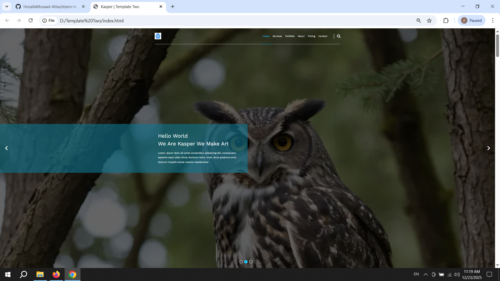
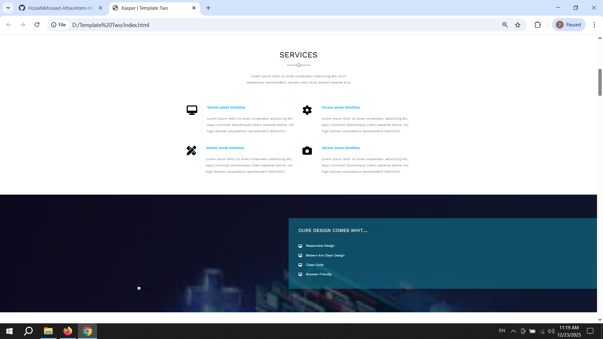
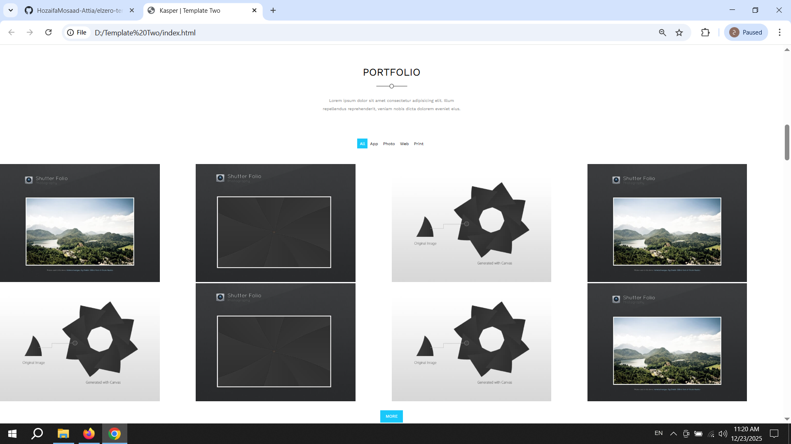
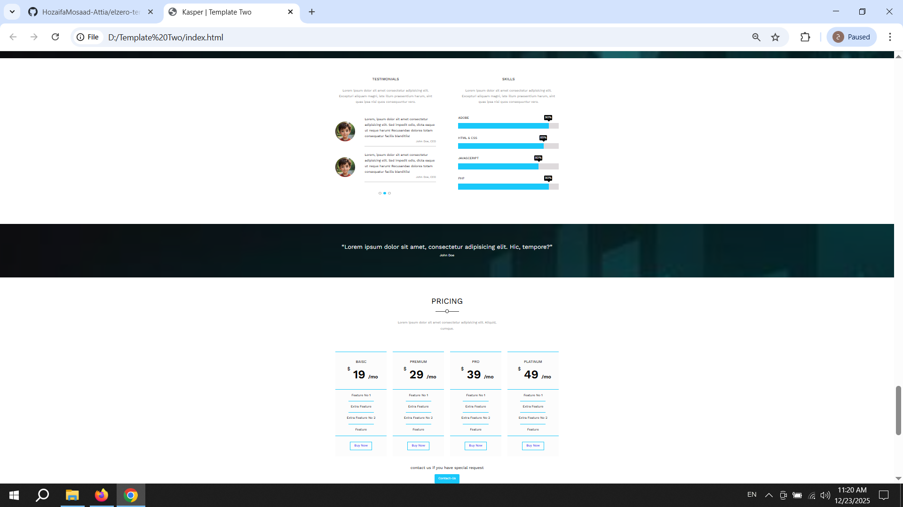
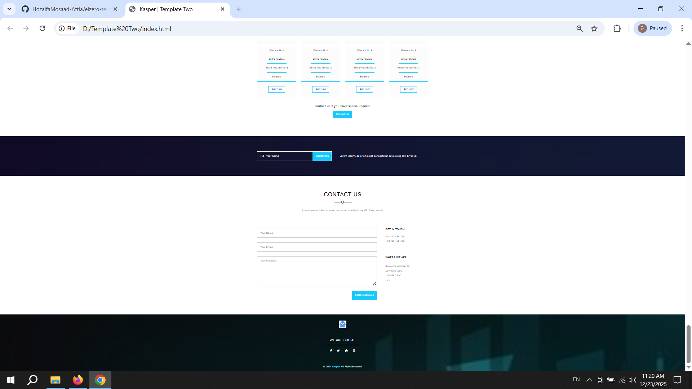

# 🏗️ Web Template Three - Professional UI
A sophisticated web template focusing on component-based design, advanced CSS positioning, and modern styling.

## 🚀 Key Features
* **Modern Components:** Styled pricing tables, services, and team sections.
* **Complex Layouts:** Using advanced CSS techniques for a structured look.
* **Fully Responsive:** Optimized for all screen sizes.
* **Interactive UI:** Smooth hover effects and polished typography.

## 📸 Project Showcase
Here is a full breakdown of the template sections:

### 1️⃣ Header & Welcome Area

### 2️⃣ Features & Services

### 3️⃣ Portfolio Gallery

### 4️⃣ About & Skills Section

### 5️⃣ Pricing & Stats

### 6️⃣ Contact & Footer

## 🛠️ Tech Stack
* **HTML5:** Semantic structure.
* **CSS3:** Advanced styling and layouts.

---
*Developed as part of the Elzero Web School frontend track.*
